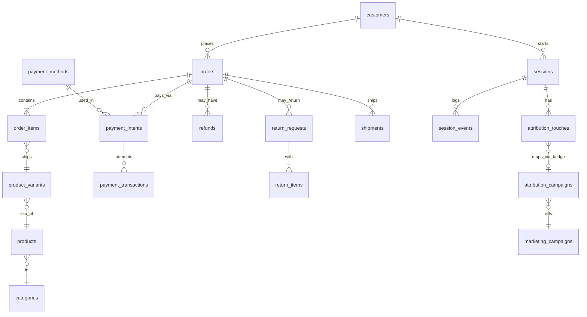

# SQL Business Insights — Task 1

A 10-query business analytics SQL project built on a 10,000-customer / 40,000-order / 100,000-session e-commerce dataset (`ecom` schema). Each query answers a real business question (from CEO-level revenue summaries to marketing attribution), is sanity-checked, and interpreted in [`INTERPRETATIONS.md`](INTERPRETATIONS.md).

Full write-up with 5 key insights: **[What 10 SQL Queries Told Me About This Business](https://sharp-postage-351.notion.site/What-10-SQL-Queries-Told-Me-About-This-Business-39ddb0c6f8c280fc8010cc98517001c3)**

Connect with me: [www.linkedin.com/in/raj-dev-63963a22b](https://www.linkedin.com/in/raj-dev-63963a22b)

## Top Business Insights

- **Retention is the real leak, not acquisition.** Month-1 retention fell from 50.2% (March cohort) to just 18.2% (May cohort) even as signups grew — the business is filling the funnel faster than it's keeping people engaged. *(Q2)*
- **Revenue is dangerously concentrated.** The top LTV bucket (`20000+`) is only 39.7% of customers but drives 88.4% of total revenue — losing a small slice of this segment would hurt far more than losing most of the rest of the customer base. *(Q8)*
- **Operational friction is concentrated, not spread out.** One payment method (UPI, 5.54% failure rate) and one carrier (EcomExpress, up to 21.4% late) are each responsible for an outsized share of a much bigger problem — meaning targeted fixes, not broad overhauls, would move the numbers. *(Q6, Q7)*

## Database Schema

## Key Visuals

**Q2 — Monthly Signup Cohort Retention**

**Q3 — Funnel Conversion by Acquisition Channel**

**Q5 — Category Health: Purchases → Returns**

**Q6 — Payment Failure Analysis**

**Q8 — Customer LTV Bucket Share of Revenue**

| LTV Bucket | Customers | % of Customers | % of Revenue |
|---|---|---|---|
| 20000+ | 3,349 | 39.7% | 88.4% |
| 5000-19999 | 2,544 | 30.1% | 9.5% |
| 1000-4999 | 2,047 | 24.3% | 2.0% |
| 0-999 | 498 | 5.9% | 0.1% |

## Repo Structure
