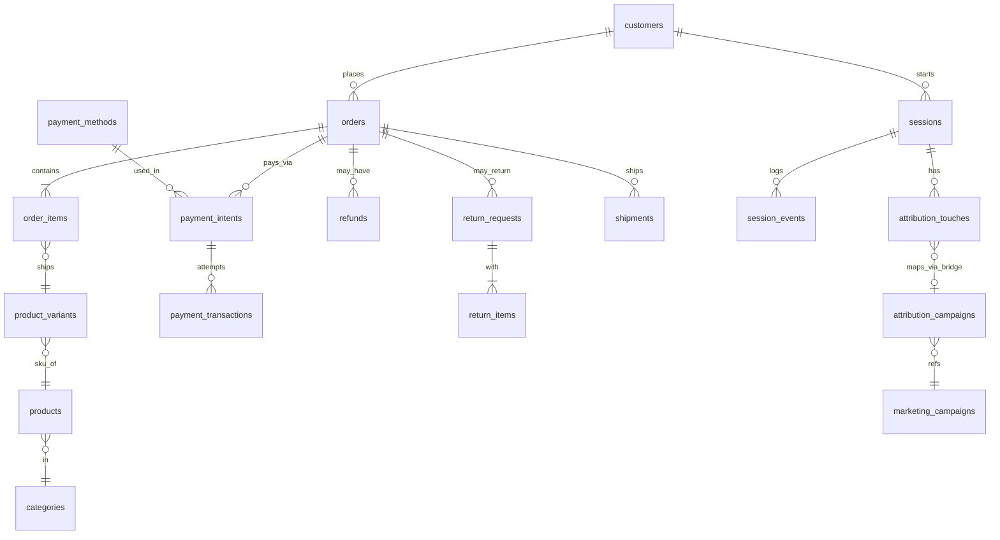
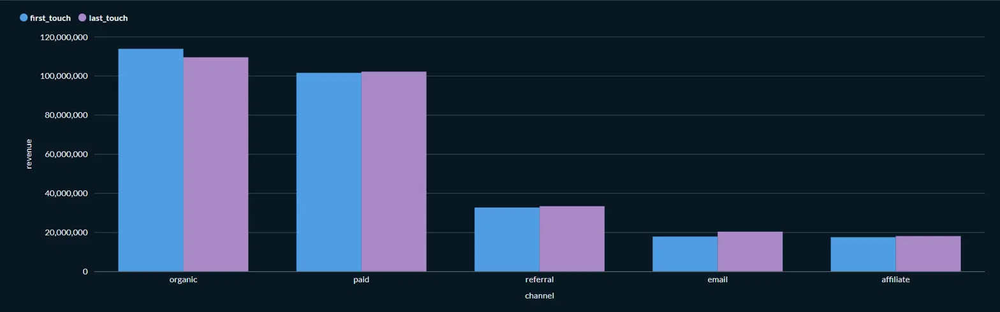
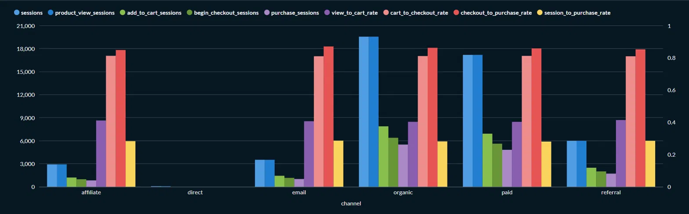
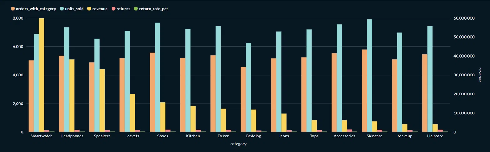
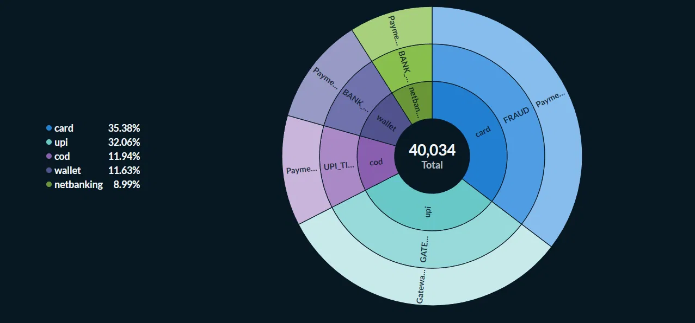

# SQL Business Insights — Task 1

A 10-query business analytics SQL project built on a 10,000-customer / 40,000-order / 100,000-session e-commerce dataset (`ecom` schema). Each query answers a real business question (from CEO-level revenue summaries to marketing attribution), is sanity-checked, and interpreted in [`INTERPRETATIONS.md`](INTERPRETATIONS.md).

Full write-up with 5 key insights: **[What 10 SQL Queries Told Me About This Business](<PASTE YOUR notion.site LINK HERE>)**

Connect with me: [www.linkedin.com/in/raj-dev-63963a22b](https://www.linkedin.com/in/raj-dev-63963a22b)

## Database Schema

## Key Visuals

**Q2 — Monthly Signup Cohort Retention**

**Q3 — Funnel Conversion by Acquisition Channel**

**Q5 — Category Health: Purchases → Returns**

**Q6 — Payment Failure Analysis**

**Q8 — Customer LTV + Bucket Share of Revenue**

## Repo Structure
