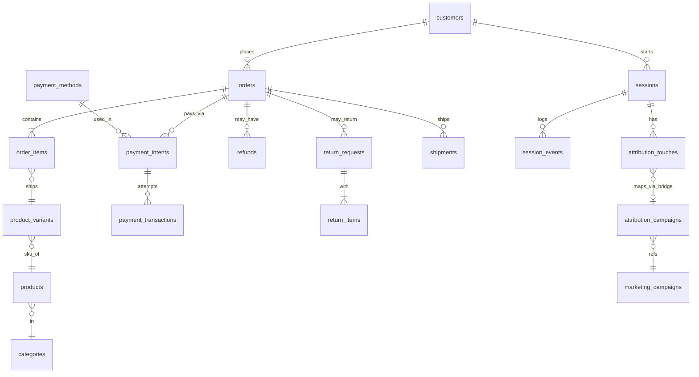

# ecom Schema Notes

## A. Table Inventory

| Table | Approx Rows | What it Stores | Grain |
|---|---|---|---|
| customers | 10,000 | customer profile info | one row per customer |
| addresses | 16,000 | postal addresses | one row per address |
| customer_addresses | 16,000 | link customer to address | one row per customer-address link |
| orders | 40,000 | order header (status, total) | one row per order |
| order_items | 81,806 | line items within an order | one row per product in an order |
| order_refunds | (view) | link order to refund | one row per refund |
| order_status_history | 158,414 | status change log per order | one row per status change |
| products | 4,000 | product catalog | one row per product |
| product_variants | 12,090 | size/color variants of product | one row per variant |
| product_images | 7,188 | product photos | one row per image |
| product_reviews | 8,000 | customer reviews | one row per review |
| categories | 18 | product categories | one row per category |
| brands | 120 | product brands | one row per brand |
| prices | 24,180 | pricing per variant | one row per price entry |
| price_lists | 2 | price list groupings | one row per price list |
| inventory_items | 2,000 | stock per variant | one row per inventory item |
| inventory_movements | 30,207 | stock in/out log | one row per movement |
| payment_intents | 40,000 | payment attempt initiation | one row per payment intent |
| payment_transactions | 40,034 | actual payment attempts (success/fail) | one row per transaction attempt |
| payment_methods | 5 | payment method lookup | one row per method type |
| refunds | 260 | refund records | one row per refund |
| return_requests | 1,603 | customer return requests | one row per return request |
| return_items | 2,004 | items within a return | one row per returned item |
| return_reasons | 8 | reason lookup | one row per reason |
| shipments | 32,089 | shipment tracking | one row per shipment |
| shipping_carriers | 3 | carrier lookup | one row per carrier |
| shipping_methods | 3 | shipping method lookup | one row per method |
| sessions | 100,000 | user browsing sessions | one row per session |
| session_events | 292,903 | event stream (view/cart/checkout/purchase) | one row per event |
| session_channels | (view) | first-touch channel per session | one row per session |
| attribution_touches | 100,000 | marketing touchpoints | one row per touch |
| attribution_campaigns | 38,405 | bridge: touch to campaign | one row per touch-campaign link |
| marketing_campaigns | 100 | campaign master data | one row per campaign |
| coupons | 50 | discount coupons | one row per coupon |
| promotions | 20 | promotion definitions | one row per promotion |
| promotion_rules | 30 | rules for promotions | one row per rule |
| loyalty_accounts | 3,000 | customer loyalty points balance | one row per customer |
| loyalty_transactions | 21,475 | loyalty points earn/redeem log | one row per transaction |
| notifications | 6,856 | sent notifications log | one row per notification |
| devices | 85,168 | customer devices | one row per device |
| experiments | 6 | A/B test definitions | one row per experiment |
| experiment_variants | 12 | variants within experiment | one row per variant |
| experiment_assignments | 140,670 | which user got which variant | one row per assignment |
| customer_segments | 10 | segment definitions | one row per segment |
| segment_memberships | 16,461 | customer-segment link | one row per membership |
| consents | 0 | consent/opt-in records (empty table) | one row per consent |
| collections | 0 | curated product collections (empty table) | one row per collection |
| collection_products | 0 | products within collection (empty table) | one row per link |

## B. Per-Column Notes (Key Tables)

### orders
- `order_id` — primary key
- `customer_id` — FK to customers.customer_id (soft, not declared)
- `session_id` — FK to sessions.session_id (soft)
- `status` — fulfillment state. Values (mixed case!): delivered (19,779), shipped (7,715), paid (3,946), packed (3,887), cancelled (2,178), placed (1,897), SHIPPED (248), DELIVERED (200), Shipped (150). **Must LOWER() before grouping/filtering.**
- `payment_status` — "did it convert" column (paid/failed) — separate from `status`. Don't confuse the two.
- `total` — headline order total; should match sum(order_items.line_total) for same order_id
- `created_at` — order placed timestamp

### order_items
- `order_id` — FK to orders.order_id
- `variant_id` — FK to product_variants.variant_id
- `line_total` — revenue for this line item

### customers
- `customer_id` — primary key
- `country` — values: India (7,641), United States (1,359), '' empty string (500), 'N/A' literal (300), NULL (200). **Three null-variants — treat all three as missing**, e.g. COALESCE(NULLIF(country,''),'N/A')
- `dob` — has sentinel values (1900-01-01, 2099-12-31) per task doc — filter unrealistic birth years before age calc
- `first_name` — has whitespace/HTML-entity encoding issues per task doc — TRIM() needed

### sessions / session_events
- `session_id` — uuid, primary key of sessions
- `session_events.event_type` — funnel stages: product_view, add_to_cart, begin_checkout, purchase
- `session_events` instrumentation launched 2026-04-19 — no events before that date (not "zero activity", just uninstrumented)

### attribution_touches
- `session_id` — FK to sessions.session_id
- `channel` — clean values: organic (39,924), paid (34,905), referral (12,146), email (6,995), affiliate (6,030)
- `utm_campaign` uses old slug format; bridge to marketing_campaigns via attribution_campaigns for campaign-level joins

### payment_intents
- `payment_intent_id` — primary key
- `order_id` — FK to orders.order_id
- `payment_method_id` — FK to payment_methods.payment_method_id (name not stored directly, must join)
- Method usage (joined): card (14,166), upi (12,801), cod (4,779), wallet (4,655), netbanking (3,599) — clean, no traps

## C. Verified Relationships

**Declared FKs (database-enforced) — only 4, all scoped to experiments:**

| Parent | Child | Join Column |
|---|---|---|
| experiments | experiment_variants | experiment_id |
| experiments | experiment_assignments | experiment_id |
| experiment_variants | experiment_assignments | exp_variant_id |
| sessions | experiment_assignments | session_id |

**Soft FKs (inferred from naming, not database-enforced) — the rest of the schema:**

| Parent | Child | Join Column |
|---|---|---|
| customers | orders | customer_id |
| orders | order_items | order_id |
| product_variants | order_items | variant_id |
| products | product_variants | product_id |
| categories | products | category_id |
| brands | products | brand_id |
| orders | payment_intents | order_id |
| payment_methods | payment_intents | payment_method_id |
| payment_intents | payment_transactions | payment_intent_id |
| orders | shipments | order_id |
| shipping_carriers | shipments | carrier_id |
| shipping_methods | shipments | shipping_method_id |
| orders | return_requests | order_id |
| return_requests | return_items | return_id |
| return_reasons | return_items | reason_id |
| sessions | session_events | session_id |
| sessions | attribution_touches | session_id |
| customers | sessions | customer_id |

Orphan check example run: `order_items → orders` on `order_id` = 0 orphan rows (verified).

## D. ER Diagram

## E. Five Things That Surprised Me

1. `orders.status` has mixed case — 'shipped'/'SHIPPED'/'Shipped' (398 rows) and 'delivered'/'DELIVERED' (200 rows) coexist. Must `LOWER()` before grouping/filtering, or ~10% of shipped/delivered orders get silently dropped from any exact-match filter.
2. `customers.country` has three null-variants: `NULL` (200 rows), `''` empty string (500 rows), and literal string `'N/A'` (300 rows) — 1,000 rows total need normalization. `WHERE country IS NOT NULL` alone would miss 800 of them.
3. Only 4 FK constraints are declared at the database level in the entire `ecom` schema, and all are scoped to the experiments subsystem. Every other relationship (orders↔customers, order_items↔orders, etc.) is a "soft" FK — inferred purely from column naming and must be verified manually via orphan checks.
4. `payment_intents` does not store the payment method name directly — only `payment_method_id`. Must join to `payment_methods` to get readable method names (card/upi/cod/wallet/netbanking).
5. `order_refunds` and `session_channels` don't appear in `pg_stat_user_tables` row counts — they are database views, not physical tables, so row counts must be checked separately with `SELECT COUNT(*)`.
